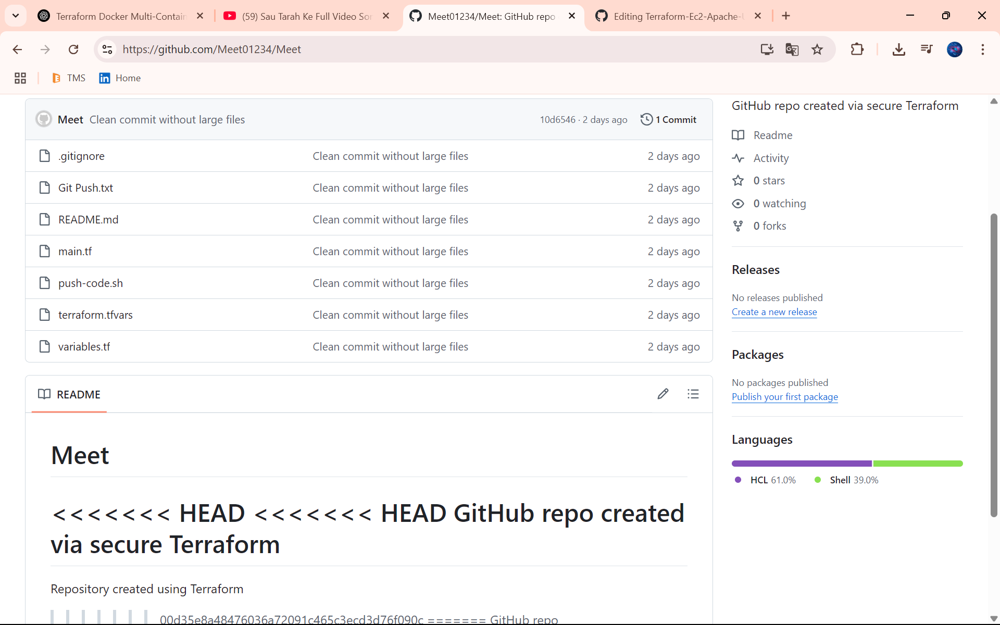

# Terraform GitHub Integration and Secure Infrastructure Provisioning

This project demonstrates a complete DevOps workflow using **Terraform**, **Git**, **GitHub**, and **AWS**.

## ✅ Tasks Covered

1. Initialize a Git Repository for Terraform Code  
2. Push Terraform Project to GitHub (First Commit)  
3. Create a `.gitignore` File for Terraform (ignore `.terraform/`, `.tfstate`, etc.)  
4. Clone and Use a Public Terraform Module from GitHub  
5. Create a New Branch for a Feature (e.g., Add Security Group)  
6. Merge Feature Branch to Main and Re-Apply Terraform  
7. Tag a Git Commit for a Specific Terraform Version (e.g., `v1.0.0`)  
8. Use a GitHub Repo as a Remote Module in Terraform (`source = "git::..."`)  

---

## 📄 main.tf

```hcl
terraform {
  required_providers {
    github = {
      source  = "integrations/github"
      version = "~> 6.0"
    }
    aws = {
      source  = "hashicorp/aws"
      version = "~> 5.0"
    }
  }
}

provider "aws" {
  region = "ap-south-1"
}

data "aws_secretsmanager_secret_version" "github_token" {
  secret_id = "github-token"
}

provider "github" {
  token = data.aws_secretsmanager_secret_version.github_token.secret_string
  owner = var.github_owner
}

resource "github_repository" "secure_repo" {
  name        = var.repo_name
  description = "GitHub repo created via secure Terraform"
  visibility  = "public"
  auto_init   = true
}

module "s3_bucket" {
  source  = "github.com/terraform-aws-modules/terraform-aws-s3-bucket"

  bucket = "my-secure-terraform-bucket-123456"
  acl    = "null"

  versioning = {
    enabled = true
  }

  tags = {
    Terraform   = "true"
    Environment = "dev"
  }
}
```

---

## 📄 variables.tf

```hcl
variable "github_token" {
  description = "GitHub personal access token (prefer env var)"
  type        = string
  default     = ""
}

variable "github_owner" {
  description = "GitHub username"
  type        = string
}

variable "repo_name" {
  description = "Name of the GitHub repository to create"
  type        = string
}
```

---

## 📄 terraform.tfvars

```hcl
github_owner = "Meet01234"
repo_name    = "Meet"
```

---

## 📄 security-group.tf

```hcl
resource "aws_security_group" "web_sg" {
  name        = "web-sg"
  description = "Allow HTTP and SSH"
  vpc_id      = module.vpc.vpc_id

  ingress {
    description = "SSH"
    from_port   = 22
    to_port     = 22
    protocol    = "tcp"
    cidr_blocks = ["0.0.0.0/0"]
  }

  ingress {
    description = "HTTP"
    from_port   = 80
    to_port     = 80
    protocol    = "tcp"
    cidr_blocks = ["0.0.0.0/0"]
  }

  egress {
    from_port   = 0
    to_port     = 0
    protocol    = "-1"
    cidr_blocks = ["0.0.0.0/0"]
  }
}
```

---

## 📄 push-code.sh

```bash
#!/bin/bash
set -e

GITHUB_REPO_URL="https://github.com/Meet01234/Meet.git"

echo "🧹 Removing old Git history..."
rm -rf .git

echo "🔄 Reinitializing Git..."
git init

echo "📝 Creating .gitignore..."
cat <<EOF > .gitignore
.terraform/
*.exe
*.tfstate
*.tfstate.backup
.terraform.lock.hcl
EOF

echo "📦 Staging and committing files..."
git add .
git commit -m "Clean commit without large files"

echo "🌿 Renaming branch to 'main'..."
git branch -m main

echo "🔗 Connecting to GitHub..."
git remote add origin "$GITHUB_REPO_URL"

echo "🚀 Pushing clean repo to GitHub..."
git push -u --force origin main

echo "✅ Done! Your repo is clean and pushed successfully."
```
---

## 📄 File Permission

```bash
chmod +x push-code.sh
```

## 📄 Run File

```bash
sudo ./push-code.sh
```

---

---

## 🧪 Terraform & Git Commands

```bash
terraform init
terraform apply -auto-approve
terraform destroy

# Git workflow
git checkout -b feature/security-group
git add . && git commit -m "Add security group"
git checkout main
git merge feature/security-group

git tag -a v1.0.0 -m "Initial version"
git push origin --tags
```

---

## 📦 Remote GitHub Module Example

```hcl
module "example" {
  source = "git::https://github.com/terraform-aws-modules/terraform-aws-vpc.git?ref=v3.0.0"
}
```

---

---


